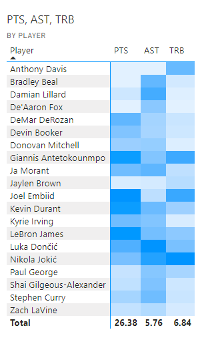

# NBA visual Analysis using Tableau and PowerBI

## Introduction

There are plenty of software tools that data scientists can leverage to implement compelling visualizations. A dashboard is a type of graphical user interface that displays various types of visual data in one place. This paper focuses on the implementation of several types of visualizations and their interactive display through a dashboard using two of the most popular software tools, Tableau and Power BI. The visualizations developed in this document are the result of an analytical and design process started in Project 2. The purpose of this paper is to compare different types of visualization addressing the same analytical question using these two tools.

## Data Analysis

The NBA is one of the most popular sports in the United States. It produces a myriad of information, including per possession, per player, and per game among others. This document focuses on the player statistics for the 2021-2022 season (Basketball Reference, 2021). 

### Analytical Questions

1. How does age affect minutes played per game?
2. How do the Top 20 players in Points per game perform in Rebounds, and Assists per game?
3. Is there a relationship between steals and personal fouls?

## How does age affect minutes played per game?

Figure 1 shows a visualization proposed to compare the age of players expressed as groups and the average minutes per game (MP) they play. The purpose of this visualization is to compare the bins of ages created on the average of minutes played. A pie chart is an efficient choice when dealing with a few categories, in this case only 6 age ranges. The intent is to allow the user to quickly spot the lower and upper ends of the minutes played. For example, with one glance a user can spot that the 40+ group has the lower average MP of all. At the same time, the 30s age group (31-34 and 35-38) seem to play the most minutes on average. To give certainty of the comparison and the exact information the values have been added as a label, both for the age group and the average MP.

Figure 2 shows a visualization using a tree map to analyze the age of players and the average minutes per game in each age category played. Since the objective is to understand if certain ages play more or fewer minutes than others, the use of a discrete variable like Ages as nodes for a tree map makes sense. There would be only 23 nodes and the size of each node would map the average of the minutes per game of all the players of that age. In addition to the size and to emphasize the point, the color of the node is also mapping the average MP. Hoovering over each node draws a tooltip with the exact average minutes played by all the players of the age in the node.

Figure 3 shows a visualization proposed using bars to compare the average minutes played versus the age of players. Bars are a well-known visualization used in many use cases. The user will find that previous experience helps them analyze this chart. This visualization is adding an extra layer of information to the number of players per age. Working with average is a powerful first-order statistic but it can also be misleading without the context of how statistically significant the sample is. Having the number of players mapped to the color of the bar enables one to ask further questions about the data. For example, the bar 37 years seems to have played the most minutes on average, but when contrasting with the number of players, the user realizes that it was just one player (LeBron James), perhaps concluding that it is an outlier. On the other hand, the bar for 24 years seems to break the trend of similar ages. The darker blue signals the user that there are more 24-year players in the league than any other age. Is there then a case of cannibalistic competition between 24 years of players? Interesting to advance the analytical inquiry.

## How do the Top 20 players in Points per game perform in Rebounds, and Assists per game?

Figure 4 shows a bubble chart chosen to map the 20 scorers' performance in assists (AST) and rebounds (TRB). The purpose of this visualization is to understand if higher scorers contribute to other positive statistics. This visualization is mapping 3 variables, AST, TRB, and points per game (PTS). AST and TRB are axes to position the markers. The size of the circular marker maps the points per game. The name of the player is added next to the marker, as well as to the tooltip in case it is not possible to render it as a label. Hovering over a point brings a dialog with the name of the player and the exact value of the three variables.

Figure 5 shows a parallel coordinates chart to map the 20 scorers' performance in assists (AST) and rebounds (TRB). The purpose of this visualization is to clearly show how the top 20 scorers compare in the three coordinates AST, TRB, and PTS. My intent was to allow the user to spot clear outliers per coordinate. The players are properly labeled if at the end of the line if there is enough space to render. In addition, the tooltip over the line provides the exact value of the three variables as well as the name of the player. Instead of using a color system to distinguish the players, as postulated in Project 2, the visualization uses a color gradient to map the point per game scored for each player. Since the goal is to compare the top 20 scorers, the intent is to keep always in mind the scoring ability of the player without having to memorize the placement of the first axis. The color not only helps to differentiate the players from each other but also to quickly spot the best scorers from the others. For example, there is a trend for the lower scorers (lighter blues) to heavily contribute to AST over TRB. This visualization was done thanks to the public contribution of (Hughes, 2020).

Figure 6 shows a Heatmap table displaying the 20 scorers' performance in PTS, AST, and TRB. The purpose of this visualization is to compare through a scale of color how these players perform comparatively against each other. The color gradient maps how each player performed on each of the variables compared to the top 20 scorers. The order of the players displayed can be arranged by name or any of the variables used. Again, the purpose is to quickly spot a player who has a disparity in their color versus the other players. For example, it is easy to spot darker rows like Nikola Jokic or Luka Doncic versus lighter rows like Jaylen Brown. On the other hand, it is also easy to detect disparities, for example, Joel Embiid specializes in PTS and TRB, while Anthony Davis is a top rebounder among the 20.

## Is there a relationship between steals and personal fouls?

Figure 7 shows a stacked 100% column chart to analyze the steals (STL) and the personal fouls (PF) per game. The purpose of the analysis is to understand if there is a relationship between the steals achieved with the fouls committed. This can be done also by looking at the relative difference. I propose to have a stacked 100% column chart for steals. Each column displays a relative area of the fouls committed per game, 0, less, or equal to 1, 2, 3, 4, and 5. The user can spot quickly which bin of STL has the highest percentage of fouls committed for either of the possible intervals. This is consistent for a basketball-related user as there are 5 fouls to give in a game. The color pattern shows how more steals lead to higher levels of personal fouls, increasing the percentage of players that averaged 2-3 PF and 3-4 PF.

## Tableau Dashboard

Figure 10 shows the dashboard for analytical questions 1 and 3. The top row has 3 visualizations addressing question 1. The lower row has 2 visualizations addressing question 2. The right panel has two filters, one for Age and another for PTS. The Age filter updates all the charts, while the PTS only updates the bottom 2 visualizations. In addition, each chart is connected to work like a filter, updating the information displayed in the other charts. The dashboard is constructed to allow the user to address each question separately but also to get additional information on the other question. As humans, we are better suited to compare information horizontally, than vertically. We are used to reading from left to right and then moving to the next row. The dashboard works with that reading motion, having first the age breakdown, age group pie chart, and then the bar chart. The user will be able to compare and interact with these three visualizations. Then as the user moves to the second row, the first visualization presents an introduction to the question, while the second visualization presents a more detailed comparison.

## PowerBI Dashboard

The power BI dashboard contains four visualizations, one addressing question 3 and three addressing question 4. Since most of the dashboard is concentrated on question 4, not only most of the visual space is used in this sense, but also the visualizations are clusters. There are two global filters implemented, Personal Fouls, and Steals. These filters are closely related to question 4 but also work with the heatmap from question 3, especially if the user wants to understand the top 20 players, who are the best stealers of the ball.

## Publication

The dashboards have been published.
* Tableau: [Link](https://public.tableau.com/views/Project03_16787531417160/Dashboard1?:language=en-US&publish=yes&:display_count=n&:origin=viz_share_link)
* Power BI: [Link](https://app.powerbi.com/links/rLpWpYSTr5?ctid=9fa4f438-b1e6-473b-803f-86f8aedf0dec&pbi_source=linkShare)

## Conclusion

The process of visualization design is an iterative process, in which development using several tools is a part. Using different tools allows the designers to contrast the art of the possible and open avenues of innovation and improvement. This project allowed testing some of the theories studied, like design principles, color, and interaction. All three elements are visible through the visualizations implemented and provide a cohesive fabric in the realization of them. Having these principles for each visualization enabled the creation of a dashboard where all charts seem to be in harmony, a design harmony.

## References

* Basketball Reference. (2021). 2021-22 NBA Player Stats: Per Game. Retrieved from Basketball Reference: https://www.basketball-reference.com/leagues/NBA_2022_per_game.html
* Hughes, E. (2020, July 9). Dynamic highlighting using Parameters on a Parallel Coordinates chart. Retrieved from The Data School: https://www.thedataschool.co.uk/erica-hughes/dynamic-highlighting-using-parameters-on-a-parallel-coordinates-chart
* Wolpert, D., & Macready, W. G. (1997). No free lunch theorems for optimization. IEEE Transactions on Evolutionary Computation, 67-82.

